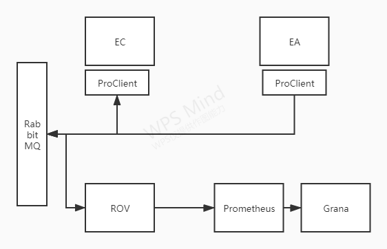

# mediasoup-signal

基于meidiasoup实现的信令服务器


## 构建 
信令服务器基于licode代码改造，基本逻辑相同
- 下载代码到本地
```
git     clone  https://github.com/QuanjieDeng/mediasoup-signal.git 
```
- 安装依赖
```
./scripts/installUbuntuDeps.sh  
```
- 安装 EC&EA
```
 ./scripts/installErizo.sh   
```
- 安装NUVE
```
 ./scripts/installNuve.sh
```
## 配置
### 修改系统栈大小 
    由于EC中存在大量的同步调用，导致部分的函数调用栈比较大，所以在部署EC的机器上需要修改其调用栈 
    目前参考的值为65500  并且在启动EC时附带参数   --stack-size=65500


licode相关的配置不在追述,这里主要说mediasoup相关的配置 
- webrtctransport监听地址
```
config.mediasoup.webRtcTransportOptions = 		{
    listenIps :
    [
        {
            ip          : process.env.MEDIASOUP_LISTEN_IP || '192.168.94.109',   //注意配置具体的ip地址
            announcedIp : process.env.MEDIASOUP_ANNOUNCED_IP
        }
    ],
    ........
};
```
- plainTransport监听地址

```
config.mediasoup.plainTransportOptions = 		{
    listenIp :
    {
        ip          : process.env.MEDIASOUP_LISTEN_IP || '192.168.94.109',
        announcedIp : process.env.MEDIASOUP_ANNOUNCED_IP
    },
    maxSctpMessageSize : 262144,
    enableSrtp : false
};


```

## 启动
分为nuve  ec,ea
- nuve   直接切到目录  nuve/nuveAPI 执行  node  nuve.js   
- ec     直接切换目录  erizo_controller/erizoController   执行 node erizoController.js   
- ea     直接切换目录  erizo_controller/erizoAgent   执行  node  erzioAgent.js

## 版本制作
在utils文件夹下提供了版本制作的脚本 release.sh
该脚本接收两个参数  v1 和v2
v1 为本次目的版本 v2 为上一版本号
脚本在gitlab上创建对应的release tag  
并制作对应tag的docker镜像推送到hub中


## Docker
### 镜像制作
- 切换到代码的根目录 
- 执行命令生成镜像 
```
docker  build  -t mediasoup-signal:v1    .
```

### 容器启动 
- mongo
```
docker run     -p  27017:27017   -v   /tmp/mongo:/opt/licode/build/db  mediasoup-signal:v1  --mongodb
```
- rabbitmq
```
docker run    -p  5672:5672  mediasoup-signal:v1 --rabbitmq
```
- nuve
```
docker run     -p  3000:3000    -e "RABBITMQ_URL=amqp:test:123456@192.168.94.109:5672"    -e "MONGO_URL=192.168.94.109/nuvedb"  mediasoup-signal:v1 --nuve
```
- ec
```
docker run   -p  8080:8080    -e "RABBITMQ_URL=amqp:test:123456@192.168.94.109:5672"   -e "PUBLIC_IP=192.168.94.109"         mediasoup-signal:v1   --erizoController
```
- ea 
```
MIN_PORT=40000 
MAX_PORT=40050
docker run   --net  host -p $MIN_PORT-$MAX_PORT:$MIN_PORT-$MAX_PORT/udp  -e "RABBITMQ_URL=amqp:test:123456@192.168.94.109:5672"  -e "PUBLIC_IP=192.168.94.109" -e  "RTCMINPORT=$MIN_PORT"  -e  "RTCMAXPORT=$MAX_PORT"  mediasoup-signal:v1  --erizoAgent

可选参数 
DEBUG环境变量 设置mediasoup子进程的日志显示
由于mediasoup的nodejs层使用 debug模块控制日志的限制
注册的民命空间有 
mediasoup：*
mediasoup:WARN*
mediasoup:ERROR*
默认不打开子进程的日志，如果需要打开则直接设置环境变量DEBUG的值即可 
例如-需要打开所有的日志 
export  DEBUG=mediasoup*

只打开WARN级别的日志
export  DEBUG=mediasoup:WARN*

```


## K8S
- 系统如果需要在K8S环境中部署，参考  doc/k8s部分
### K8S环境中worker子进程的日志如何打开
-子进程的日志分为两级，一级是worker进程的日志 二级是nodejs层面的日志
nodejs层面只是控制要显示哪些等级，具体的可以在  licode_config.js 配置文件中设置
子进程的日志等级通过环境变量 DEBUG的值进行设置，需要注意的是，nodejs层面只是对worker子进程的日志进行过滤，
前提是wokrer子进程把日志抛出

## ROV数据采集
- ROV组件做为遥测数据源，提供遥测数据，供Prometheus等开源组件进行展示，
- 定期到系统的各个组件拉取数据

### 启动
- ROV程序的启动文件为 erizo_controller/ROV/rovMetricsServer.js
```
cd  erizo_controller/ROV
node  rovMetricsServer.js
```

### 结构拓扑

### 采集指标
- activeRooms: 全局范围内的总room数量
- activeClients: 全局范围内总的client数量
- totalPublishers: 全局范围内总的produce数量
- totalSubscribers: 全局范围内总的consume数量
- activeErizoJsProcesses: mediasoup-worker数量
- totalICEconnectionsFailed: ICE连接错误报告数量
- totalDTLSconnectionsFailed: DTLS连接错误报告数量
- totalSCTPconnectionsFailed: SCTP错误状态报告数量
- produceScore: mediasoup报告produce传输RTP质量分数  0-10
- consumeScore: mediasoup报告comsume传输RTP质量分数  0-10
- rpcCost: rpc调用平均耗时-毫秒


## 链路追踪
- 链路追踪使用skywalking，我们在nuve/ec/ea的进程中都加载了skywalking的数据搜集插件
### 配置
- 你可以通过配置项,去配置是否开启等设置，模式是开启的模式
```
config.skywalking = {};
//set the url  of  skywalking-collection
config.skywalking.url = "localhost:11800";
config.skywalking.authentication = "";
//set the switch open or  not
config.skywalking.open = true 
```
