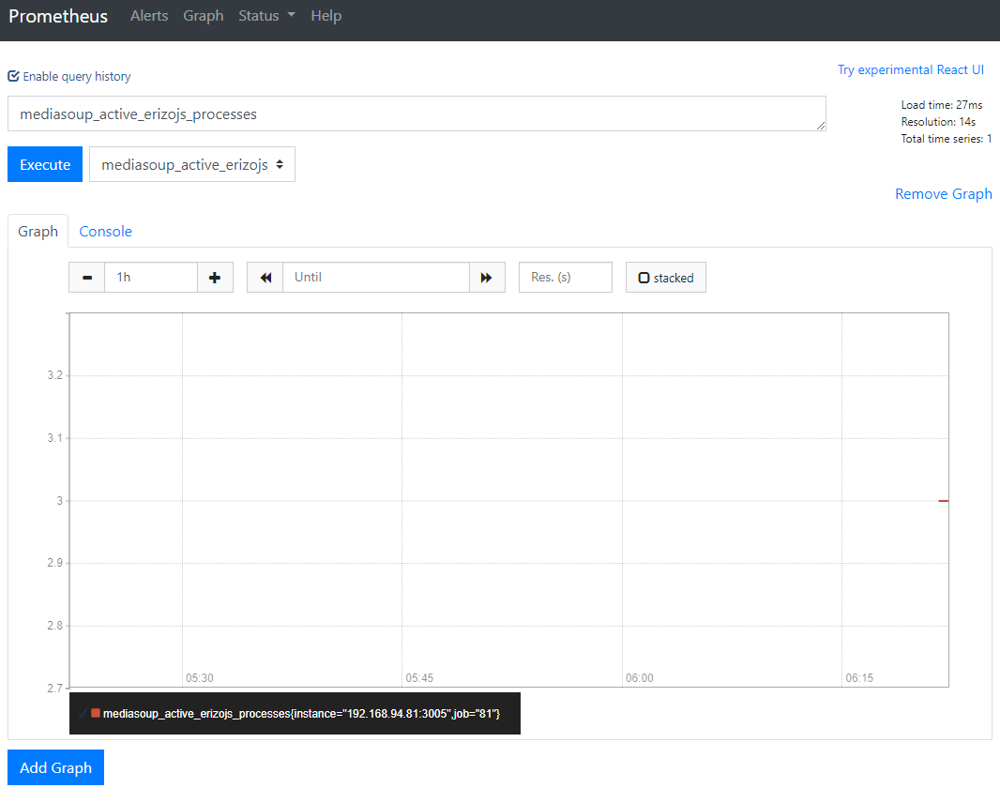

## 简介
- Prometheus为开源组件，负责从ROV中拉取数据，然后提供给Grafana进行展示 
- 官网 https://prometheus.io/

## 安装
- 直接下载可执行文件，下载地址https://prometheus.io/download/
	  解压后 直接通过命令行启动 
  ```
  ./prometheus  --config.file=./prometheus.yml   
  ```

- 使用docker启动
docker  run -p   9090:9090   prom/prometheus   

- UI 
默认监听的服务端口为  9090，启动成功后可以通过  http://host:9090/ 进行访问 

## 配置
- Promethes的配置文件为 Prometheus.yml
```
# my global config
global:
 #scrape_interval 设置检测数据的间隔时间，这里配置的是10秒一次
  scrape_interval:     10s # Set the scrape interval to every 15 seconds. Default is every 1 minute.
  #evaluation_interval 设置报警规则的检测时间这里配置的是 10s检测一次报警规则
  evaluation_interval: 10s # Evaluate rules every 15 seconds. The default is every 1 minute.
  # scrape_timeout is set to the global default (10s).

# Alertmanager configuration
alerting:
  alertmanagers:   #配置    alertmanager的信息
  - static_configs:
    - targets:
       - 192.168.94.141:9093

# Load rules once and periodically evaluate them according to the global 'evaluation_interval'.
rule_files:
   - /root_soft/prometheus-2.21.0.linux-amd64/rule/*.yml

# A scrape configuration containing exactly one endpoint to scrape:
# Here it's Prometheus itself.
# 配置数据源
scrape_configs:
  - job_name: '81'
    static_configs:
    - targets: ['192.168.94.81:3005']
```

### 数据源
- 数据源为一个http接口，配置数据源需要在启动前，在配置文件中配好
```
scrape_configs:
  # The job name is added as a label `job=<job_name>` to any timeseries scraped from this config.
  - job_name: 'k8s'

    # metrics_path defaults to '/metrics'
    # scheme defaults to 'http'.

    static_configs:
    - targets: ['10.254.50.99:3005']
  - job_name: '141'
    static_configs:
    - targets: ['192.168.94.141:3005']
如果需要添加多个数据源，就添加多个  job_name  节点
```
### 数据面板
- prometheus提供一些简单的数据面板，方便直观的观察一些数据,成功启动后，可以直接在9090端口进行访问 



## 报警
- 除了基本的数据指标搜集之外，你可以通过配置文件制定报警规则，当警报触发后，通过一些工具发送报警消息
### 简介 
Prometheus中的报警分为两个部分，
Prometheus服务器把报警信息推送到 AlerManager
AlertManager在将报警信息推送到具体的渠道  如邮件、通知平台、聊天系统等等
报警的设置主要分为三步 
第一步：启动&设置AlertManager
第二部：配置prometheus和AlerManager沟通
第三部：在Promethes中创建报警规则


### Prometheus告警规则
告警规则都使用YAML文件创建
告警名称：用户需要为告警规则命名，当然对于命名而言，需要能够直接表达出该告警的主要内容
告警规则：告警规则实际上主要由PromQL进行定义，其实际意义是当表达式（PromQL）查询结果持续多长时间（During）后出发告警

```
groups://可以将一组相关联的告警放在一个组下面
- name: example
  rules:   
  - alert: HighErrorRate  告警名称
    expr: job:request_latency_seconds:mean5m{job="myjob"} > 0.5    PromQL查询语句
    for: 10m  评估等待时间，只有持续该时间才会被认为是告警
    labels:  告警标签
      severity: page
    annotations:   附件信息 一些描述信息等等
      summary: High request latency 概要信息
      description: description info  详细信息
```
配置Prometheus使用该规则
为了让Pro去使用这些规则，需要在他的配置文件中在rule_file标签中指定报警规则文件的路径
```
rule_files:
  [ - <filepath_glob> ... ]
```

evaluation_interval 标签参数定义多久去检测一次，默认是1分钟

### 启动&配置AlertManager
	AlertManager处理来自其他客户端的警报消息，并且把它转发到具体的比如邮件、聊天等平台
	安装  https://prometheus.io/download/  或者是直接通过镜像启动 
	
    管理器通过配置文件来管理规则，如果配置文件需要更新，可以直接编辑然后给hup信号

    启动方式 ./alertmanager --config.file=alertmanager.yml
AlertManager主要提供以下的几点功能特性 
- 分组：
	将一类告警信息合并成一条信息，避免一些情况下接收到大量的告警信息
- 抑制
	抑制是指当某一告警发出后，可以停止重复发送由此告警引发的其它告警的机制。
- 静默
	静默提供了一个简单的机制可以快速根据标签对告警进行静默处理
	静默设置需要在Alertmanager的Werb页面上进行设置。
### AlertManager配置详解
AM的配置文件大致分成几个部分 
#### 全局配置
	主要是配置一些全局的，比如SMTP 微信接口信息 等等这些信息
	resolve_timeout 
#### Route
	路由配置转发的规则，当接收到警告时根据路由规则转发到对应的receiver
	一个完整的路由应该包含下面这些信息 
[ receiver: <string> ]  接受者
[ group_by: '[' <labelname>, ... ']' ]  分组标签 只要包含该标签的都会被认为是一组
[ continue: <boolean> | default = false ] true匹配到第一个route节点就停止,false则会继续匹配

##### match:
  [ <labelname>: <labelvalue>, ... ]   匹配标签

##### match_re:
  [ <labelname>: <regex>, ... ]    匹配正则表达式 

[ group_wait: <duration> | default = 30s ]   组等待时间，主要是为了把一些报警合并成一次报警一次性发送
[ group_interval: <duration> | default = 5m ] 相同的group两次报警的间隔
[ repeat_interval: <duration> | default = 4h ] 发送警告通知之前的等待时间

#### routes:
  [ - <route> ... ]  子路由，子路由和顶级路由包含的字段是一样的，也就是路由是可以嵌套使用的
#### receivers
	接受者，定义具体的接收者的信息
	一个完整的receiver的包含下面的信息
name: <string>   名称 每个revice都有一个全局的名称
email_configs:    邮件配置
  [ - <email_config>, ... ]
hipchat_configs:
  [ - <hipchat_config>, ... ]
pagerduty_configs:
  [ - <pagerduty_config>, ... ]
pushover_configs:
  [ - <pushover_config>, ... ]
slack_configs:
  [ - <slack_config>, ... ]
opsgenie_configs:
  [ - <opsgenie_config>, ... ]
webhook_configs: webhook配置信息
  [ - <webhook_config>, ... ]
victorops_configs:
  [ - <victorops_config>, ... ]

下面是一个示例的配置文件 
```
global:
  resolve_timeout: 5m 

route:
  group_by: ['mediasoup_transfer_server']   组名，和prometheus中的rule的组名相同
  group_wait: 10s
  group_interval: 10s
  repeat_interval: 10s
  receiver: 'web.hook'   指定全局的接收者
receivers:
- name: 'web.hook'
  webhook_configs:
  - url: 'http://192.168.94.145:8000/api/webhook/feishu?token=8c2dd62902d7d20552b200da5258c90b'    接收者是webhook的地址
inhibit_rules:
  - source_match:
      severity: 'critical'
    target_match:
      severity: 'warning'
    equal: ['alertname', 'dev', 'instance']
```