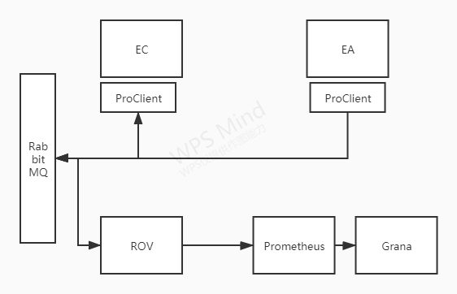

## 简介
- ROV负责信令服务器的指标搜集，然后对外提供HTTP接口，方便Prometheus拉取

## 架构图 

### 采集指标
- activeRooms: 全局范围内的总room数量
- activeClients: 全局范围内总的client数量
- totalPublishers: 全局范围内总的produce数量
- totalSubscribers: 全局范围内总的consume数量
- activeErizoJsProcesses: mediasoup-worker数量
- totalICEconnectionsFailed: ICE连接错误报告数量
- totalDTLSconnectionsFailed: DTLS连接错误报告数量
- totalSCTPconnectionsFailed: SCTP错误状态报告数量
- produceScore: mediasoup报告produce传输RTP质量分数  0-10
- consumeScore: mediasoup报告comsume传输RTP质量分数  0-10
- rpcCost: rpc调用平均耗时-毫秒