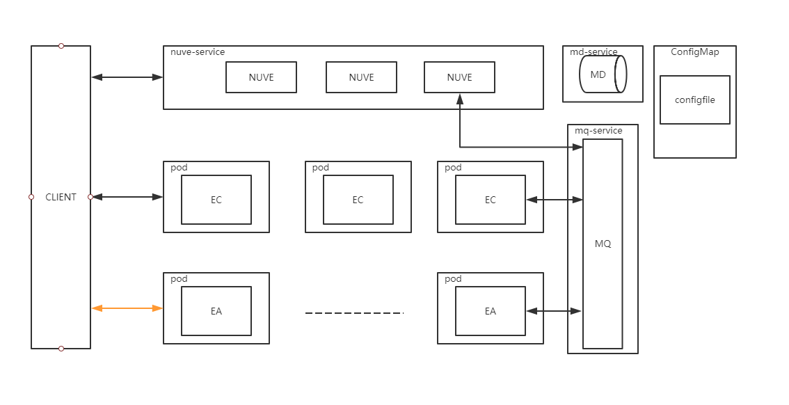

## K8S部署模型 

## 各个节点部署的思路
-  nuve 是无状态的，可以使用k8s-service 类型为nodeport
-  mongodb 对外封装一个service pod之间直接使用域名进行沟通
-  rabbitmq 对外封装一个service pod之间直接使用域名进行沟通
-  EC 在集群内部是没有人连接他的 他是客户端直接连接，用户在哪个EC上是nuve分配的 所以不对他构建任何的service
   EC的连接地址 -是在配置文件中直接配置死  二是 配置网卡名称 从网卡上获取
   由于是在K8S环境中，容器的重启可能会换node节点 所以还是配置网卡比较好  有个要求是 机器的外网IP 统一配置相同的网卡名称  这样配置文件好管理

-  EA+EJ是绑定在一起的，理论上一个node 不可以部署多个EA,因为端口占用比较多 EA最终在流媒体数据交互时也时和客户端互通的，而且端口不一定 没办法创建servie，直接部署成pod即可


### 环境变量
- licode的镜像中启动脚本 需要使用一些环境变量的配置，我们先在ConfigMap中创建好
然后在 创建 k8s负载时 直接使用ConfigMap

### 配置文件
- 通过文件创建ConfigMap的方式去创建一个配置文件
- 配置文件更新时需要重启整个deploment
```
kubectl rollout restart deployment +<部署名称>
```


## 部署步骤
- 所有集群内的主机的外网网卡名称统一修改为eth0
- 修改start.sh中的  namespace
- 执行start.sh 等待执行完成即可，如果需要手动执行则参考 start.sh中步骤执行即可

## 使用ingress
- 如果希望通过使用ingress的方式暴露服务，首先需要在K8S集群中部署Ingress  Controler，目前主流的有nginx-ingress/haproxy/istiso
- 为nuve的创建Ingress Resource,关联到nuve-service
- 修改  start-with-ingress.sh中ns即可   执行步骤已经整理在脚本中   需要注意的是使用ingress暴露服务我们使用的是 ClusterIP模式的Service

## 关于数据落地
- mongodb的数据落地有两种方式，一种是直接本地挂载的方式，但是K8S环境中pod的调用等情况会导致变化node,会有数据丢失、不同步的风险
- 第二种是使用外部存储服务，比如NFS服务，如果需要使用nfs服务，需要提前部署好NFS服务器,修改  mongodb-pv-licode.yaml中NFS服务器的信息，然后执行start.sh

## NFS服务器
- NFS对外公布的路径为 /nfs_mongodb    mongodb的挂载路径为  /nfs_mongodb/mongodb  注意需要配置模式为no_root_squash


## k8s中资源使用限制&请求
- EC中一个room平均占用为200字节，10万用户单个节点占用内存大概在20M
- EA中一个room平均占用200字节，10万用户单个节点占用内存大概在20M
### k8s中可以通过配置resuource字段，实现对pod中容器的资源使用限制和请求 
- 请求resource.request  标识该pod的基础要求，只有符合该要求的node才能部署pod
- 限制resource.limit    标识该pod的限制，当pod的实际使用量超过限制，将会被重新调用
一个比较完善的请求示例
```
       containers:
        - name: nuve
          image: docker-registry.ztgame.com.cn/im/mediasoup-signal:1.0.2
          args: ["--nuve"]
          imagePullPolicy: IfNotPresent
          resources:
            requests:
              memory: "64Mi" //设置最低配置内存64M
              cpu: "250m"    
            limits:
              memory: "128Mi" //设置最大内存128M
              cpu: "500m"
```
- 内存单位
内存资源的基本单位是字节（byte）。你可以使用这些后缀之一，将内存表示为 纯整数或定点整数：E、P、T、G、M、K、Ei、Pi、Ti、Gi、Mi、Ki。 例如，下面是一些近似相同的值：

128974848, 129e6, 129M , 123Mi

- cpu单位
CPU 资源以 CPU 单位度量。Kubernetes 中的一个 CPU 等同于：

1 个 AWS vCPU
1 个 GCP核心
1 个 Azure vCore
裸机上具有超线程能力的英特尔处理器上的 1 个超线程

小数值是可以使用的。一个请求 0.5 CPU 的容器保证会获得请求 1 个 CPU 的容器的 CPU 的一半。 
你可以使用后缀 m 表示毫。例如 100m CPU、100 milliCPU 和 0.1 CPU 都相同。 精度不能超过 1m。

CPU 请求只能使用绝对数量，而不是相对数量。0.1 在单核、双核或 48 核计算机上的 CPU 数量值是一样的。


## pod的生命周期
- pod的生命周期中的状态探测主要有 启动探测 就绪探测 存活探测
- 启动探测只在pod启动时起作用，就绪探测和存活探测在贯穿pod的整个生命周期 


### 启动探测器
- 启动探测器主要是应对那些可能启动会非常慢的容器的状态检查,主要有EXEC  HTTP TCP三种方式 
- 启动探测器只在启动时起作用，一旦通过检测，后面就交给 存活检查和 就绪检查 
- 如果提供了启动探测(startup probe),则禁用所有其他探测,直到它成功为止
```
startupProbe:
  httpGet:
    path: /healthz
    port: liveness-port
  failureThreshold: 30
  periodSeconds: 10
```
- failureThreshold 表示最大尝试次数 periodSeconds表示重试间隔 


### 就绪检查
- 就绪检查针对pod在启动前，进行就绪状态的检查，只有通过就绪检查，pod状态才会被置为read 参与流量分配 
- 就绪探测器在容器的整个生命周期中保持运行状态

- 设置格式 
```
readinessProbe:
  exec:
    command:
    - cat
    - /tmp/healthy
  initialDelaySeconds: 5
  periodSeconds: 5

``` 

### 存活检查 
- 存活检查的目的是在pod的整个运行周期中，定时的检查pod的存活状态 
- 检查的手段有三种 exec  http tcp  
- initialDelaySeconds 标识第一次执行前需要等待的时间
- periodSeconds 表示间隔时间 
- failureThreshold 标识失败容忍次数 
- successThreshold 表示成功认定次数
```
//EXEC
    livenessProbe:
      exec:
        command:
        - cat
        - /tmp/healthy
      initialDelaySeconds: 5 
      periodSeconds: 5
      failureThreshold: 3
      successThreshold: 1
      timeoutSeconds: 1
//HTTP
   livenessProbe:
      httpGet:
        path: /healthz
        port: 8080
        httpHeaders:
        - name: Custom-Header
          value: Awesome
      initialDelaySeconds: 3
      periodSeconds: 3
//TCP
livenessProbe:
      tcpSocket:
        port: 8080
      initialDelaySeconds: 15
      periodSeconds: 20
```